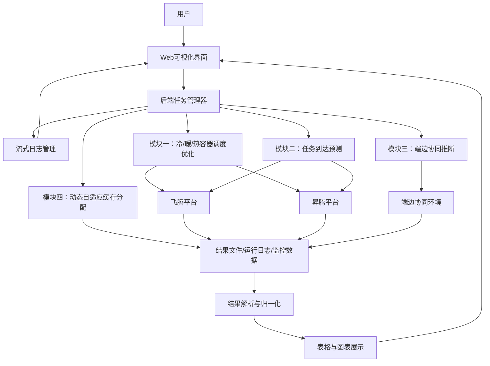
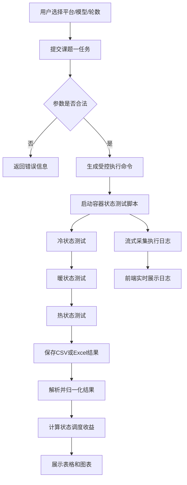
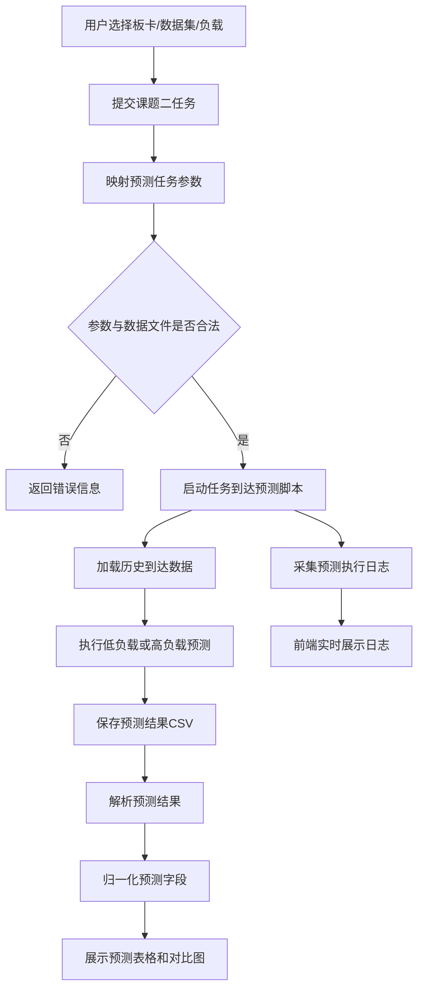
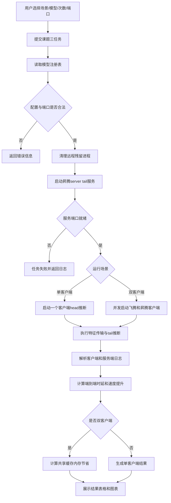
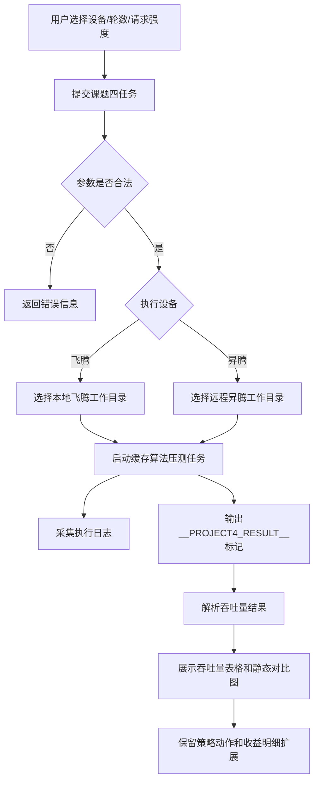

<table><tr><td>

</td></tr><tr><td></td></tr><tr><td>
<strong>面向异构智能任务的操作系统弹性缓存技术</strong>
</td></tr><tr><td></td></tr><tr><td></td></tr><tr><td></td></tr><tr><td>
<strong>软件需求规格说明</strong>
</td></tr><tr><td></td></tr><tr><td></td></tr><tr><td></td></tr><tr><td>
共 1 册   第 1 册
</td></tr><tr><td></td></tr><tr><td>
南京理工大学
</td></tr><tr><td></td></tr><tr><td>
2026年 6 月
</td></tr></table>

<table><tr><td colspan="3" rowspan="2">
项      目

名      称
</td><td colspan="8" rowspan="2">
面向异构智能任务的操作系统弹性缓存技术
</td><td colspan="3">
文  件  号
</td></tr><tr><td colspan="3">
ECS/SRS-V1.0.0
</td></tr><tr><td colspan="3">
文 件 名 称
</td><td colspan="8">
面向异构智能任务的操作系统弹性缓存技术软件需求规格说明
</td><td colspan="3">
V1.0.0
</td></tr><tr><td colspan="14"></td></tr><tr><td>
序号
</td><td colspan="3">
更改标记
</td><td colspan="2">
数量
</td><td colspan="2">
更改通知单号
</td><td colspan="2">
签    名
</td><td colspan="3">
日  期
</td><td>
备  注
</td></tr><tr><td colspan="2">
编制
</td><td colspan="3"></td><td colspan="2"></td><td colspan="2"></td><td colspan="3"></td><td colspan="2"></td></tr><tr><td colspan="2">
审核
</td><td colspan="3"></td><td colspan="2"></td><td colspan="2"></td><td colspan="3"></td><td colspan="2"></td></tr><tr><td colspan="2">
标检
</td><td colspan="3"></td><td colspan="2"></td><td colspan="2">
批准
</td><td colspan="3"></td><td colspan="2"></td></tr></table>

目  录

- [1 引言](#1-引言)
  - [1.1 编写目的](#11-编写目的)
  - [1.2 软件需求分析](#12-软件需求分析)
- [2 系统概述](#2-系统概述)
  - [2.1 项目背景](#21-项目背景)
  - [2.2 需求概述](#22-需求概述)
  - [2.3 弹性缓存系统结构](#23-弹性缓存系统结构)
- [3 系统功能需求](#3-系统功能需求)
  - [3.1 基于冷、暖、热三状态的容器调度优化模块需求](#31-基于冷暖热三状态的容器调度优化模块需求)
  - [3.2 任务到达预测模块需求](#32-任务到达预测模块需求)
  - [3.3 端边协同推断模块需求](#33-端边协同推断模块需求)
  - [3.4 动态自适应缓存分配模块需求](#34-动态自适应缓存分配模块需求)
- [4 软硬件或其他外部系统接口需求](#4-软硬件或其他外部系统接口需求)
  - [4.1 用户界面需求](#41-用户界面需求)
  - [4.2 硬件需求](#42-硬件需求)
  - [4.3 网络需求](#43-网络需求)
  - [4.4 接口需求](#44-接口需求)
  - [4.5 通信需求](#45-通信需求)
  - [4.6 运行环境](#46-运行环境)

# 1 引言

## 1.1 编写目的

本文档适用的系统为：面向异构智能任务的操作系统弹性缓存技术软件。本文档旨在为该软件提供全面的软件需求定义和描述，明确系统应实现的功能、输入输出、运行约束、接口要求和验收依据，为后续软件设计、编码实现、系统测试和交付验收提供统一基线。

该软件面向华为昇腾、飞腾等异构平台及端边协同环境，支持通过前端可视化界面发起智能任务实验，由后端调度本地脚本、远程服务器脚本和客户端脚本执行，并将执行日志、性能结果和对比图表返回界面展示。系统软件分为四个模块：

基于冷、暖、热三状态的容器调度优化模块。提供交互式界面供用户选择硬件平台、运行模型和执行轮数，执行冷状态、暖状态和热状态下的容器启动与模型推理测试，可视化展示不同状态下的启动时延、端到端时延、资源占用和性能提升比。

任务到达预测模块。提供交互式界面供用户选择板卡类型、数据集分组和负载等级，基于历史任务到达数据执行低负载或高负载场景下的任务到达预测，并展示预测结果、误差指标、任务完成时间和负载对比图表。

端边协同推断模块。提供交互式界面供用户选择运行场景、模型、统计次数和服务端口，支持昇腾服务器与昇腾客户端、昇腾服务器与飞腾客户端、昇腾服务器与飞腾客户端加昇腾客户端等协同推断场景，展示端到端平均时延、速度提升比和共享切分缓存内存节省效果。

动态自适应缓存分配模块。当前已开放吞吐量实验运行入口，支持选择昇腾或飞腾执行设备、设置执行总轮数和请求强度，后端调用本地或远程缓存算法任务并返回吞吐量结果。该模块继续保留缓存状态采集、模型热度评估、资源约束评估、策略生成、策略执行和策略展示扩展能力，后续将综合容器状态收益、任务到达预测结果、端边协同收益和设备资源状态，生成缓存保留、释放、预热、迁移和共享复用策略。

## 1.2 软件需求分析

### 1.2.1 软件需求分析理论

软件需求分析是将用户目标、业务场景和工程约束转化为可实现、可验证、可追踪的软件需求规范的过程。对于“面向异构智能任务的操作系统弹性缓存技术软件”，需求分析不仅需要明确前端界面和后端任务接口，还需要结合异构智能任务运行过程中的冷启动开销、缓存状态保持、任务到达波动、端边协同链路和设备资源约束，形成可测试的功能要求与性能指标。

有效的软件需求应满足完整性、一致性、可验证性、可追踪性和可修改性。完整性要求需求覆盖系统主要功能、外部接口、运行环境和安全约束；一致性要求不同模块之间的输入输出关系不存在冲突；可验证性要求每项需求可以通过测试、日志、结果文件或界面展示进行确认；可追踪性要求需求可以映射到设计说明、实现模块和测试用例；可修改性要求需求表达清晰，便于后续根据实现范围进行增补。

### 1.2.2 软件需求分析目标

本项目的软件需求分析旨在将弹性缓存技术的业务目标和工程约束转化为可执行、可验收的软件需求，确保系统在异构硬件、动态负载和端边协同条件下能够稳定支撑智能任务运行。具体目标如下：

（1）功能性目标：明确系统四个模块需要实现的核心功能与用户交互路径。用户应能够通过可视化界面选择课题模块、运行平台、模型、数据集、负载等级、运行场景、统计次数和端口等参数，发起实验任务并查看日志和结果。

（2）可验证的性能目标：明确各模块应输出可量化指标。容器状态调度模块应输出冷、暖、热状态下的时延和资源指标；任务到达预测模块应输出预测值、误差指标和任务完成时间；端边协同推断模块应输出端到端时延、速度提升比和内存节省指标；动态自适应缓存分配模块当前应输出吞吐量、执行轮数和请求强度，后续应输出预期时延收益、内存收益和缓存动作。

（3）约束与兼容性目标：明确软件应支持的硬件平台、运行环境、网络通信和远程执行约束，确保系统能够在飞腾、昇腾及相关边缘计算环境中部署，并能对本地进程、远程进程、结果文件和流式日志进行统一管理。

（4）可扩展性目标：当前系统覆盖四个模块的运行、展示和结果对比能力，同时为动态自适应缓存分配模块的缓存动作明细、基线吞吐量、收益计算和策略下发预留数据结构、接口定义和展示位置，保证后续新增策略算法时不破坏现有模块边界。

# 2 系统概述

## 2.1 项目背景

随着智能服务从单一模型推理逐步发展为多模型、多平台、多负载条件下的异构智能任务执行，操作系统需要在有限算力、有限内存、有限网络带宽以及动态任务到达的约束下，为智能任务提供稳定、高效、可调度的运行支撑。异构智能任务通常具有模型规模差异大、启动时延敏感、缓存资源竞争强、端边协同链路复杂等特点。若仍采用静态缓存配置或单一调度策略，系统容易出现容器冷启动频繁、缓存命中率不足、任务排队时延上升、端边协同收益不稳定等问题。

因此，需要设计并实现面向异构智能任务的操作系统弹性缓存技术软件，通过状态感知、到达预测、协同推断和动态缓存分配，支撑智能任务在多平台、多设备和多负载场景下的高效运行。该软件既需要面向用户提供清晰的可视化交互和结果展示能力，也需要面向后端提供可控的任务调度、远程执行、日志采集、结果解析和扩展接口能力。

## 2.2 需求概述

基于以上背景，系统需要围绕异构智能任务运行过程中的缓存保持、任务预测、端边协同和资源自适应分配建立完整的软件能力。系统应实现以下四个关键技术模块：

基于冷、暖、热三状态的容器调度优化模块。本模块应支持采集和展示不同智能任务容器在冷状态、暖状态和热状态下的启动时延、推理时延、任务完成时间和资源占用情况。冷状态表示容器尚未加载模型与运行环境，启动时延较高；暖状态表示容器已完成部分环境初始化或缓存保留，可降低启动开销；热状态表示模型或服务已经保持就绪，适合承接高频任务。模块应支持飞腾、昇腾等平台的对比测试，并通过表格和图表展示状态调度优化对任务时延和资源利用率的影响。

任务到达预测模块。本模块应支持基于历史任务到达数据、负载等级和数据集来源执行任务到达预测分析。系统应支持Google数据集、Huawei数据集等数据分组，支持低负载和高负载场景，支持昇腾、飞腾等板卡类型。模块应输出预测结果、实际结果、误差指标、任务完成时间和负载对比结果，为后续决定模型预热、缓存保留和缓存回收提供依据。

端边协同推断模块。本模块应支持模型切分、端侧head执行、边侧tail执行和中间特征传输。系统应支持昇腾服务器、昇腾客户端、飞腾客户端等角色组合，能够根据运行场景加载模型权重、模型结构和切分配置，启动服务端和客户端推断进程，并展示各客户端的端到端时延、服务端尾部推断时延、传输时延、速度提升比以及共享切分缓存带来的内存节省。

动态自适应缓存分配模块。本模块应支持吞吐量实验和综合决策扩展能力，当前版本能够根据执行设备、总轮数和请求强度运行缓存算法任务并展示吞吐量结果；后续将根据模型访问频率、任务到达趋势、容器状态收益、端边协同收益、设备内存状态和任务优先级，动态决定缓存保留、缓存释放、缓存预热、缓存迁移和共享缓存复用。

## 2.3 弹性缓存系统结构

面向异构智能任务的操作系统弹性缓存技术软件由用户界面层、后端任务管理层、算法与脚本执行层、结果解析与可视化层、平台资源层组成。系统通过前端界面接收用户参数，通过后端任务接口启动本地或远程任务，通过结果解析模块统一读取CSV、Excel或日志结果，并通过图表组件展示性能指标。

基于冷、暖、热三状态的容器调度优化模块由用户界面子模块、任务参数配置子模块、容器状态调度执行子模块、结果解析子模块、图表展示子模块和运行日志管理子模块组成。用户界面子模块负责接收平台、模型和轮数参数；任务参数配置子模块负责参数校验和脚本映射；容器状态调度执行子模块负责调用本地或远程脚本执行实验；结果解析子模块负责统一结果字段；图表展示子模块负责展示状态收益；运行日志管理子模块负责实时返回执行过程。

任务到达预测模块由用户界面子模块、预测参数配置子模块、预测任务执行子模块、数据集管理子模块、结果解析子模块和预测结果展示子模块组成。该模块用于在不同板卡类型、不同数据集来源和不同负载等级下执行预测实验，为缓存预热和缓存保留提供任务到达趋势依据。

端边协同推断模块由用户界面子模块、场景参数配置子模块、模型注册管理子模块、服务端推断执行子模块、客户端推断执行子模块、协同结果解析子模块和共享缓存收益计算子模块组成。该模块用于在端侧设备与边侧服务器之间执行模型切分推断实验，比较单端执行与端边协同执行的端到端时延，并评估共享缓存收益。

动态自适应缓存分配模块由用户界面子模块、运行参数配置子模块、缓存算法执行子模块、吞吐量结果解析子模块、静态图表展示子模块和策略扩展子模块组成。当前版本已支持执行设备、总轮数和请求强度配置，并以吞吐量结果验证缓存调度效果；后续将以模块一、模块二、模块三的结果作为策略输入，生成动态缓存分配方案。

# 3 系统功能需求

## 3.1 基于冷、暖、热三状态的容器调度优化模块需求

### 3.1.1 核心功能要求

本模块应支持在异构硬件平台上验证容器缓存状态对智能任务启动时延、执行时延和资源占用的影响。模块应允许用户选择硬件平台、运行模型和执行轮数，自动执行冷状态、暖状态和热状态下的容器启动与推理测试，输出不同状态下的任务完成指标，并展示暖状态、热状态相对冷状态的性能收益。

模块应满足以下要求：

（1）支持飞腾、昇腾等硬件平台选择，并根据平台选择本地执行或远程执行路径。

（2）支持单模型测试和全部模型测试，模型选择范围应由受控配置或枚举列表提供。

（3）支持用户输入执行轮数，系统应校验轮数为正整数，并以相同轮数执行不同状态实验。

（4）支持实时显示脚本启动、状态切换、测试进度、结果保存和异常信息。

（5）支持解析CSV或Excel结果文件，统一展示模型名称、状态类型、启动时延、端到端时延、资源占用和性能提升比等指标。

（6）支持以表格和图表形式展示冷、暖、热状态对比结果，并为动态缓存分配模块提供状态收益数据。

表1 基于冷、暖、热三状态的容器调度优化模块功能表

| 功能模块 | 实现功能 |
| --- | --- |
| 配置参数模块 | 硬件平台选择 |
| 配置参数模块 | 模型选择 |
| 配置参数模块 | 执行轮数输入 |
| 容器状态调度模块 | 执行冷状态容器启动与推理测试 |
| 容器状态调度模块 | 执行暖状态容器启动与推理测试 |
| 容器状态调度模块 | 执行热状态容器快速响应测试 |
| 结果展示模块 | 执行日志展示 |
| 结果展示模块 | 冷、暖、热状态性能对比展示 |
| 结果展示模块 | 时延、资源占用和提升比图表展示 |

### 3.1.2 执行流程

本模块执行流程如下：

1. 用户选择课题一、硬件平台、运行模型和执行轮数。
2. 前端将参数提交至后端任务启动接口。
3. 后端校验平台、模型和轮数参数，生成受控执行命令。
4. 后端创建任务记录并启动本地或远程脚本执行进程。
5. 脚本依次执行冷状态、暖状态和热状态容器调度测试，记录每轮任务指标。
6. 后端持续采集执行日志，并通过事件流返回前端展示。
7. 脚本完成后，后端读取结果文件并解析为统一结果表。
8. 前端展示结果表格、状态对比图和性能收益数据。

图1 基于冷、暖、热三状态的容器调度优化模块执行流程图

## 3.2 任务到达预测模块需求

### 3.2.1 核心功能要求

本模块应支持基于历史任务到达数据执行任务到达趋势预测，为缓存预热、缓存保留和任务调度提供依据。模块应允许用户选择板卡类型、数据集分组和负载等级，执行低负载或高负载条件下的预测任务，并展示预测结果与性能对比。

模块应满足以下要求：

（1）支持昇腾、飞腾等板卡类型选择，并根据板卡类型选择对应运行环境。

（2）支持Google数据集、Huawei数据集等数据分组选择，后端应根据分组定位历史任务到达数据。

（3）支持低负载和高负载场景选择，低负载场景用于验证平稳到达条件下的预测效果，高负载场景用于验证突发到达条件下的预测效果。

（4）支持预测脚本执行过程可观察，展示数据加载、预测运行、结果保存和异常信息。

（5）支持解析预测结果CSV文件，展示预测到达值、实际到达值、误差指标、负载等级和任务完成时间。

（6）支持不同板卡、不同数据集和不同负载条件下的预测结果对比展示。

表2 任务到达预测模块功能表

| 功能模块 | 实现功能 |
| --- | --- |
| 配置参数模块 | 板卡类型选择 |
| 配置参数模块 | 数据集分组选择 |
| 配置参数模块 | 负载等级选择 |
| 数据集管理模块 | 定位历史任务到达数据 |
| 数据集管理模块 | 选择低负载或高负载数据切片 |
| 预测执行模块 | 调用任务到达预测脚本 |
| 预测执行模块 | 生成预测结果文件 |
| 结果展示模块 | 预测结果表格展示 |
| 结果展示模块 | 负载对比和误差指标图表展示 |

### 3.2.2 执行流程

任务到达预测模块执行流程如下：

1. 用户选择课题二、板卡类型、数据集分组和负载等级。
2. 前端向后端任务启动接口提交预测任务参数。
3. 后端将用户选项映射为脚本可识别的板卡、数据集和负载参数。
4. 后端校验参数范围和数据文件可用性。
5. 后端创建任务记录并启动预测脚本。
6. 预测脚本加载指定历史任务到达数据，执行任务到达预测并保存结果。
7. 后端采集预测日志并实时返回前端。
8. 预测完成后，后端解析CSV结果文件并归一化字段。
9. 前端展示预测结果表格、负载对比图和误差指标。

图2 任务到达预测模块执行流程图

## 3.3 端边协同推断模块需求

### 3.3.1 核心功能要求

本模块应支持在端侧设备与边侧服务器之间执行模型切分推断实验，验证端边协同推断对端到端时延和内存占用的优化效果。模块应允许用户选择运行场景、模型、统计次数和服务端口，后端根据模型注册表加载权重、结构和切分配置，启动服务端与客户端推断进程，并展示协同推断结果。

模块应满足以下要求：

（1）支持昇腾server/昇腾client、昇腾server/飞腾client、昇腾server/飞腾client+昇腾client等运行场景。

（2）支持从模型注册表加载模型配置，用户只能选择注册表中存在且配置完整的模型。

（3）支持用户输入统计次数，系统应校验统计次数为正整数，并用于端到端平均时延统计。

（4）支持用户输入服务端口，系统应校验端口范围为1024至65535，并在server启动前执行端口检查或残留进程清理。

（5）支持先启动服务端、再启动客户端的协同编排流程；双客户端场景下应支持飞腾客户端和昇腾客户端并发执行。

（6）支持解析客户端和服务端日志，提取Baseline端到端时延、Ours端到端时延、服务端tail推断时延、传输时延和速度提升比。

（7）支持双客户端场景下共享切分缓存内存节省值和节省比展示。

表3 端边协同推断模块功能表

| 功能模块 | 实现功能 |
| --- | --- |
| 配置参数模块 | 运行场景选择 |
| 配置参数模块 | 模型选择 |
| 配置参数模块 | 统计次数输入 |
| 配置参数模块 | 服务端口输入 |
| 模型注册管理模块 | 查询模型权重、结构和切分配置 |
| 服务端执行模块 | 启动边侧tail推断服务 |
| 客户端执行模块 | 启动端侧head推断和特征传输 |
| 协同结果解析模块 | 解析时延、传输和速度提升指标 |
| 共享缓存收益模块 | 计算双客户端共享切分缓存内存节省 |

### 3.3.2 执行流程

端边协同推断模块执行流程如下：

1. 用户选择课题三、运行场景、模型、统计次数和服务端口。
2. 后端读取模型注册表，获得模型权重、结构名称、输入尺寸和切分配置。
3. 后端校验运行场景、模型配置、统计次数和端口范围。
4. 后端清理远程昇腾服务器上的残留server进程和端口占用。
5. 后端构建server启动命令，并在远程昇腾服务器上以 ONNX Runtime 模式启动tail推断服务。
6. 后端等待服务端口就绪。
7. 单客户端场景下，后端启动一个客户端推断进程；双客户端场景下，后端并发启动飞腾客户端和昇腾客户端。
8. 客户端执行head推断、中间特征传输、服务端tail推断调用和端到端时延统计。
9. 客户端完成后，后端解析日志并计算速度提升比。
10. 双客户端场景下，后端计算共享切分缓存内存节省值和节省比。
11. 前端展示执行日志、速度提升结果和内存节省结果。

图3 端边协同推断模块执行流程图

## 3.4 动态自适应缓存分配模块需求

### 3.4.1 核心功能要求

本模块用于综合容器状态调度、任务到达预测、端边协同推断和设备资源状态，生成动态缓存分配策略。当前版本已开放吞吐量实验运行入口，系统应支持用户选择执行设备、执行总轮数和请求强度，启动缓存算法任务并展示吞吐量结果；同时应保留缓存状态采集、策略动作、基线对比和收益明细等扩展点。

模块应满足以下要求：

（1）支持选择执行设备，执行设备范围包括昇腾远程节点和飞腾本机节点。

（2）支持输入执行总轮数，系统应校验总轮数为正整数。

（3）支持选择请求强度，当前请求强度范围为6、8、10 req/s。

（4）支持后端根据执行设备选择本地飞腾工作目录或远程昇腾工作目录执行缓存算法任务。

（5）支持实时展示缓存算法任务启动、压测执行、结果保存和异常信息。

（6）支持解析任务日志中的结果标记，展示执行设备、执行总轮数、请求强度、吞吐量、基线吞吐量和吞吐量提升比，其中基线吞吐量和提升比为后续扩展字段。

（7）后续完整策略实现时，应支持采集模型缓存状态、容器状态、共享切分缓存状态、设备内存、CPU/NPU负载和网络带宽。

（8）后续完整策略实现时，应支持读取模块一、模块二和模块三输出，并根据模型热度、预测到达趋势、资源约束和协同收益生成缓存保留、缓存释放、缓存预热、缓存迁移和共享复用策略。

表4 动态自适应缓存分配模块功能表

| 功能模块 | 实现功能 |
| --- | --- |
| 配置参数模块 | 执行设备选择 |
| 配置参数模块 | 执行总轮数输入 |
| 配置参数模块 | 请求强度选择 |
| 缓存算法执行模块 | 调用飞腾本机或昇腾远程缓存算法任务 |
| 吞吐量结果解析模块 | 解析__PROJECT4_RESULT__结果标记 |
| 结果展示模块 | 展示吞吐量结果和静态吞吐量对比图 |
| 策略扩展模块 | 预留缓存状态采集、策略生成和收益明细展示 |

### 3.4.2 执行流程

动态自适应缓存分配模块当前执行流程如下：

1. 用户选择课题四、执行设备、执行总轮数和请求强度。
2. 前端向后端任务启动接口提交topicId、device、rounds和requestIntensity。
3. 后端校验执行设备、总轮数和请求强度范围。
4. 后端根据执行设备选择飞腾本地工作目录或昇腾远程工作目录。
5. 缓存算法执行子模块启动缓存调度器压测任务并采集执行日志。
6. 结果解析子模块从日志中读取__PROJECT4_RESULT__标记并解析吞吐量结果。
7. 前端展示执行日志、吞吐量结果表和静态吞吐量对比图。
8. 后续完整策略实现时，系统将继续采集缓存状态和资源状态，读取模块一至模块三收益并生成缓存分配策略。

图4 动态自适应缓存分配模块执行流程图

# 4 软硬件或其他外部系统接口需求

## 4.1 用户界面需求

系统应提供基于Web的可视化用户界面，界面应满足以下需求：

（1）支持课题模块选择，至少包括冷、暖、热三状态容器调度优化、任务到达预测、端边协同推断和动态自适应缓存分配四个模块入口。

（2）支持根据模块动态展示参数表单。模块一展示硬件平台、模型和执行轮数；模块二展示板卡类型、数据集分组和负载等级；模块三展示运行场景、模型、统计次数和服务端口；模块四展示执行设备、执行总轮数和请求强度。

（3）支持任务启动、任务取消、日志查看和结果展示。长时间运行任务不应阻塞界面操作，用户应能观察任务运行状态。

（4）支持动态表格展示后端返回的rows行数据结构，并由前端根据行对象字段键名生成表格列，避免将不同模块结果列固化在前端。

（5）支持通过ECharts或等效图表组件展示状态调度收益、预测对比结果、端边协同时延提升、吞吐量对比和缓存收益。

（6）界面应对参数缺失、参数非法、任务失败、结果文件缺失和日志解析异常提供明确提示。

## 4.2 硬件需求

系统运行和测试涉及以下硬件环境：

（1）华为昇腾服务器：用于运行边侧tail推断服务、昇腾平台任务和远程脚本。

（2）华为昇腾客户端：用于端边协同场景下执行端侧head推断和客户端统计任务。

（3）飞腾客户端或飞腾运行节点：用于运行飞腾平台容器状态测试、任务到达预测和端边协同客户端任务。

（4）K3s集群运行节点：用于容器化智能任务运行和后续缓存调度扩展。

（5）网络互联设备：用于保证前端、后端、飞腾客户端、昇腾客户端和昇腾服务器之间的通信连接。

## 4.3 网络需求

系统网络需求如下：

（1）前端页面应能够访问后端服务接口、日志事件流接口和静态结果资源目录。

（2）后端服务应能够访问本地脚本、飞腾执行环境和远程昇腾服务器。

（3）端边协同推断场景下，客户端应能够连接服务端监听端口，服务端口范围应限制在1024至65535之间。

（4）双客户端场景下，飞腾客户端和昇腾客户端应能够并发连接同一服务端或按场景配置连接对应服务端。

（5）系统应具备端口占用检查和残留进程清理能力，避免多次运行造成端口冲突。

## 4.4 接口需求

系统接口包括人机交互接口、后端任务接口、日志接口、结果文件接口、远程执行接口、Pods环境清理接口和策略扩展接口。

表5 系统接口需求表

| 接口名称 | 类型 | 接口数据内容 | 提供方 | 使用方 |
| --- | --- | --- | --- | --- |
| 课题选择接口 | 人机交互接口 | 课题编号、课题名称 | 用户界面 | 后端任务管理器 |
| 模块一任务启动接口 | 软件接口 | 平台、模型、执行轮数 | 用户界面 | 后端任务管理器 |
| 模块二任务启动接口 | 软件接口 | 板卡类型、数据集分组、负载等级 | 用户界面 | 后端任务管理器 |
| 模块三任务启动接口 | 软件接口 | 运行场景、模型、统计次数、服务端口 | 用户界面 | 后端任务管理器 |
| 任务日志接口 | 软件接口 | 任务ID、日志行、任务状态 | 后端任务管理器 | 用户界面 |
| 结果文件接口 | 文件接口 | CSV文件、Excel文件、运行日志 | 脚本执行进程 | 结果解析模块 |
| 远程执行接口 | 软件接口 | 受控server命令、受控client命令 | 后端任务管理器 | 远程昇腾设备 |
| 模型注册接口 | 配置接口 | 模型权重、结构、切分配置、运行目录 | 模型注册表 | 端边协同模块 |
| 模块四任务启动接口 | 软件接口 | 执行设备、执行总轮数、请求强度 | 用户界面 | 后端任务管理器 |
| Pods环境清理接口 | 软件接口 | 受控模型Deployment缩容请求 | 用户界面 | K3s接口 |
| 缓存策略扩展接口 | 软件接口 | 缓存状态、资源状态、策略动作和预期收益 | 动态缓存模块 | 用户界面和策略执行模块 |

接口应满足以下约束：

（1）后端任务接口应在任务启动前完成参数合法性校验。

（2）远程执行接口不应接受用户输入的任意命令字符串，应由后端根据受控配置生成命令。

（3）结果文件接口应检查文件存在性、字段完整性和数值可解析性。

（4）日志接口不应输出远程登录凭据、模型权重内容和不必要的敏感路径。

（5）模型注册接口应保证模型配置完整，若权重、结构或切分配置缺失，应拒绝任务启动。

## 4.5 通信需求

系统通信需求如下：

（1）前端与后端之间采用HTTP接口提交任务参数，采用事件流或等效流式机制获取任务日志。

（2）后端与本地脚本之间采用子进程调用方式通信，通过标准输出、标准错误和结果文件获取执行结果。

（3）后端与远程昇腾服务器或昇腾客户端之间采用受控远程命令执行方式通信，远程命令参数由后端配置生成。

（4）端边协同推断过程中，客户端与服务端通过指定端口建立通信链路，传输中间特征并获取tail推断结果。

（5）任务取消时，后端应终止本地和远程相关进程，并更新任务状态为cancelled。

## 4.6 运行环境

软件运行环境需求如下：

硬件环境：华为昇腾服务器、华为昇腾客户端、飞腾客户端、K3s集群运行节点及必要的网络互联环境。

软件环境：Python 3.9，Node.js，Vue 2，Element UI，ECharts，openpyxl，PyTorch，torchvision，timm，ONNX，ONNX Runtime，ACL，CANN，sshpass，Locust。

数据环境：系统应具备模型注册配置、任务到达数据集、容器状态实验结果目录、端边协同日志目录和静态图表数据目录。

安全环境：系统应支持输入合法性校验、远程命令参数约束、端口占用检查、残留进程清理、任务取消保护和日志范围控制。远程登录凭据应支持通过环境变量或受控配置管理，不应在日志中输出。

部署环境：前端、后端和实验脚本可以部署在同一工作站或分布式部署在多个节点上。后端服务节点应具备访问本地结果目录、远程昇腾设备和飞腾执行环境的权限。
